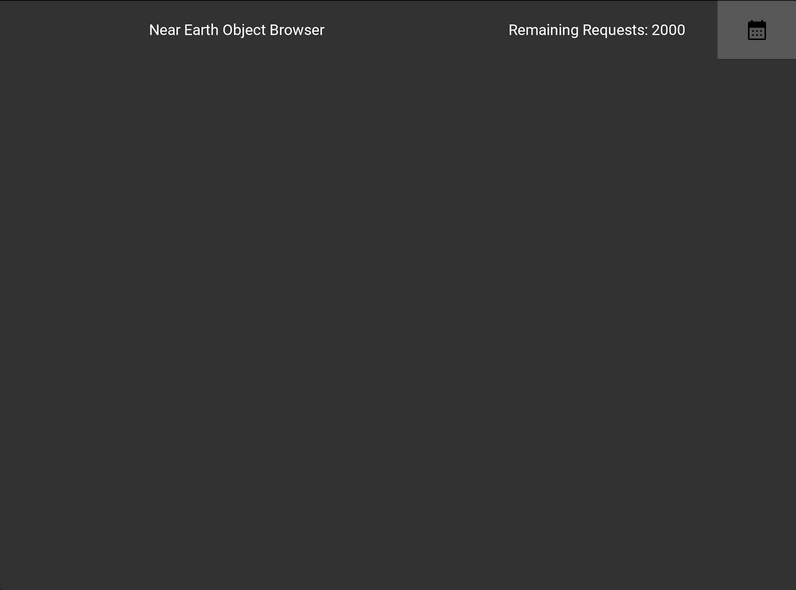

# Fund That Flip neoWs Coding Challenge
A near earth object browser utilizing the NASA NEO API.  The application is built with the Kivy UI
framework, aiohttp, and the pyson database.  Tests are implemented using pytest.

## Implementation Decisions
I decided to implement the storage of NEO data based on user input from the UI.  The basic reasoning
here is that the NEO API allows 2000 requests per hour.  This limits the ability to store all the
data using an API crawler due to the fact that the API supports at most a week of data per request.
Since there are 2107 weeks between 12-10-1982 and 04-30-2023 the API limit would be reached and
there would be an hour delay before additional data could be requested.

On the other hand, the crawler approach may have been feasible given that the request limit is reset
based on a running counter, and if the latency of the requests allowed for the counter to reset
before the limit was reached then the data could be stored in a single run. But the crawler would
still take over an hour to complete.

pysondb was chosen as the database to simplify the implementation.  I wanted to preserve the
semantic structure of the JSON data as opposed to flattening it into a tabular format.

## Main Features
* Implementation of a Calendar Widget to select dates to begin searching for NEOs.
* Translation of the raw NEO data into a filtered format that stores imperial units only,
  stores only the last four digits of the 'neo_reference_id', and stores epochs from the API
  in ISO8601 format.
* A GUI to easily view the NEO data based on date and paging between dates through the UI.

## macOS Install Instructions
1. Install Brew: `/bin/bash -cpyth "$(curl -fsSL https://raw.githubusercontent.com/Homebrew/install/HEAD/install.sh)"`
2. Install Python 3.10 as currently required by the Kivy: `brew install python@3.10` - this will not overwrite your default python installation
3. Install system dependencies required for Kivy: `brew install pkg-config sdl2 sdl2_image sdl2_ttf sdl2_mixer`
4. Update the system Python3 build dependencies: `python3 -m pip install --upgrade pip setuptools virtualenv`
5. Clone the repository: `git clone https://github.com/tyler-conrad/ftf_neows.git`
5. Navigate into the cloned repository: `cd ftf_neows`
6. Create a virtual environment based on Python 3.10: `python3 -m virtualenv -p  /opt/homebrew/opt/python@3.10/libexec/bin/python venv`
7. Activate the virtual environment: `source venv/bin/activate`
8. Upgrade the build dependencies for the Python 3.10 virtual environment: `python -m pip install --upgrade pip setuptools`
9. Install the project dependencies: `python -m pip install -r requirements.txt`
10. Run the application: `python main.py`

## Testing
1. Make sure your current working directory is the repository root folder.
2. Run: `pytest`
